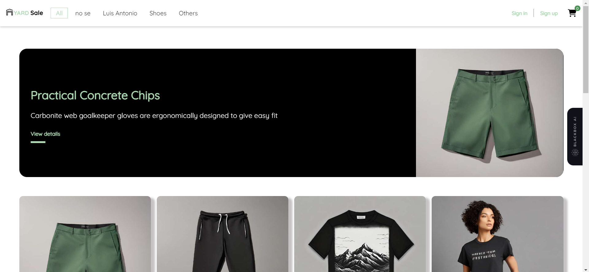
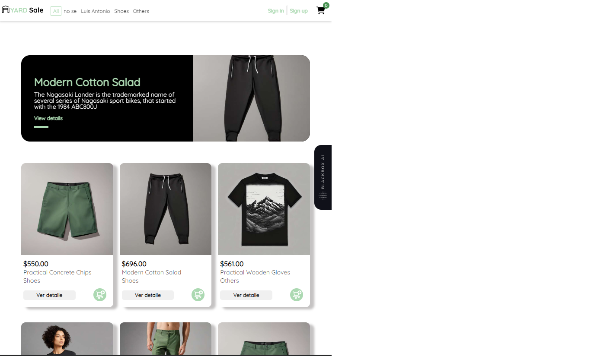
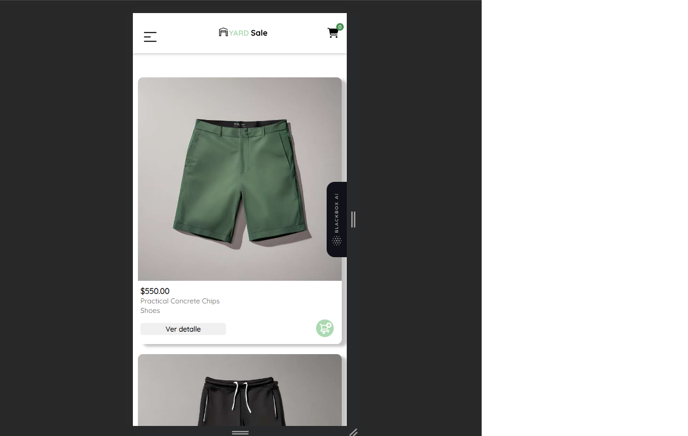
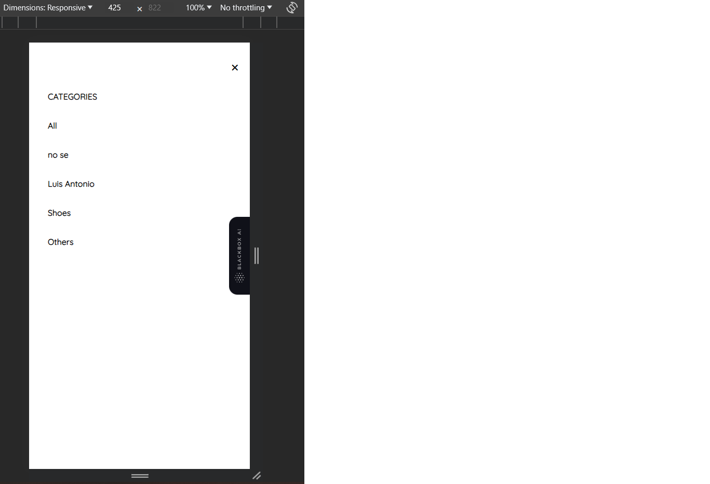
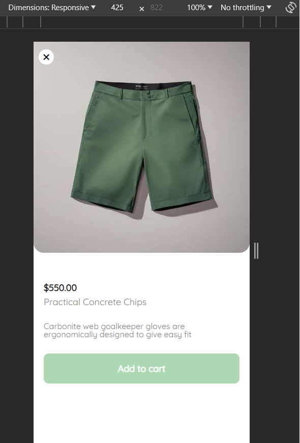
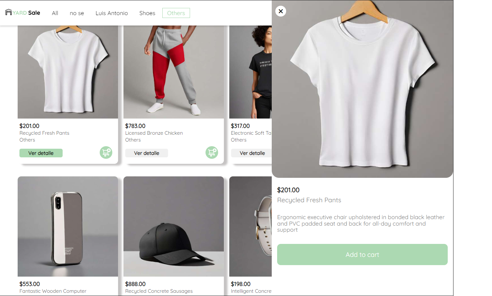
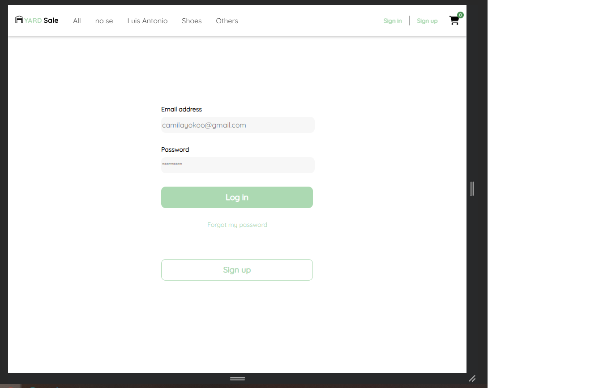
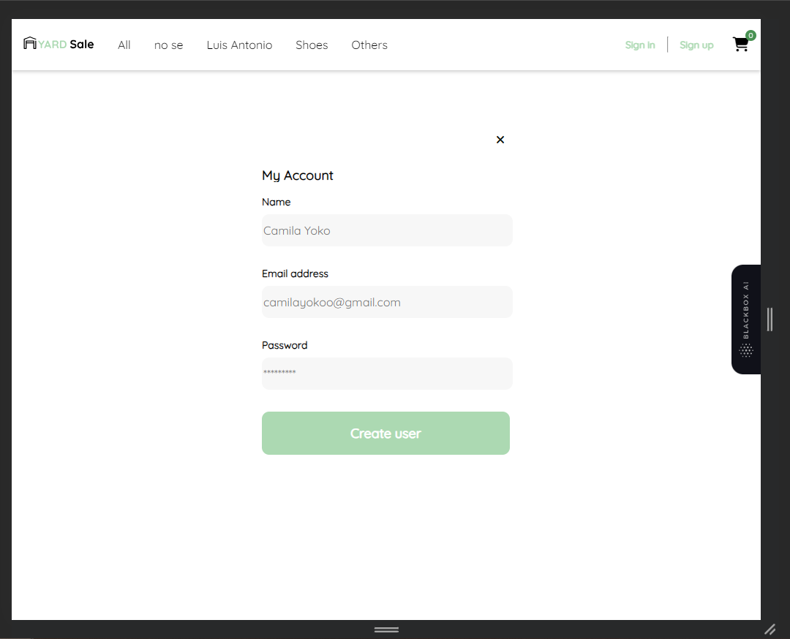
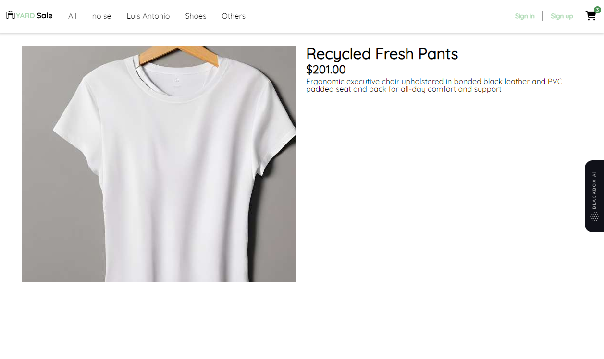

# My-Store

- La aplicación esta desplegada en Netlify: [Link](https://subtle-frangollo-509af5.netlify.app/home)

My-store es una plataforma de comercio desarrollada en Angular que permite a los usuarios explorar e interactuar con una amplia gama de productos en línea. Esta aplicación está diseñada para brindar una experiencia de navegación conveniente y segura. Este proyecto se generó con Angular CLI versión 16.0.1.

Nota: Para crear un usuario y hacer login debes habilitar el button del app.component.html, de esta forma te creara un usuario predeterminado en app.component.ts y podras hacer login con dicho usuario dentro del nav.

## Tabla de Contenidos

- [My-Store](#my-store)
  - [Tabla de Contenidos](#tabla-de-contenidos)
  - [Introducción](#introducción)
  - [Características Principales](#características-principales)
  - [Capturas de Pantalla](#capturas-de-pantalla)
  - [Instalación](#instalación)
  - [Uso](#uso)
  - [Tecnologías Utilizadas](#tecnologías-utilizadas)
  - [Licencia](#licencia)

## Introducción

My-store una solución de comercio electrónico que permitirá a los usuarios buscar, ver detalles, agregar al carrito y comprar productos en línea.

## Características Principales

- 🚧 Búsqueda de productos 🚧
- 🚧 Carrito de compras 🚧
- 🚧 Registro y autenticación de usuarios 🚧
- 🚧 Integración con API externa de productos🚧
- 🚧 Programación modular 🚧
- 🚧 Navegación entre rutas 🚧
- 🚧 Despliegue a producción 🚧

## Capturas de Pantalla

Capturas de pantalla:

## Instalación

Proporciona instrucciones claras y concisas para que otros desarrolladores puedan configurar y ejecutar tu proyecto en sus entornos locales. Esto puede incluir:

1. Clonar el repositorio:  
   `git clone https://github.com/Dev-Joshua/my-store`

2. Navegue al directorio del proyecto:  
   `cd my-store`

3. Instalar dependencias:  
   `npm install`

4. Ejecutar la aplicación:  
   `ng serve`  
   Abra su navegador y vaya a http://localhost:4200.

## Uso

Para comenzar a usar my-store, siga estos pasos:

1. Explore la página de inicio para ver productos destacados.

2. Habilite el botón para crear un usuario en el app.component.ts y app.component.html. Así podrá crear el usuario predeterminado y logearse en el nav para hacer el proceso de autenticación mediante un token.

3. Haga clic en un producto para ver más detalles, ya sea dando click en la imagen o directamente en el botón de ver detalle para activar el slide o product-detail.

4. Agregue productos al carrito de compras del nav.

## Tecnologías Utilizadas

Las principales tecnologías y herramientas utilizadas en este proyecto son:

- HTML
- SCSS
- Angular 16
- FontAwesome
- Node.js
- API REST

## Licencia

Este proyecto está bajo la MIT
